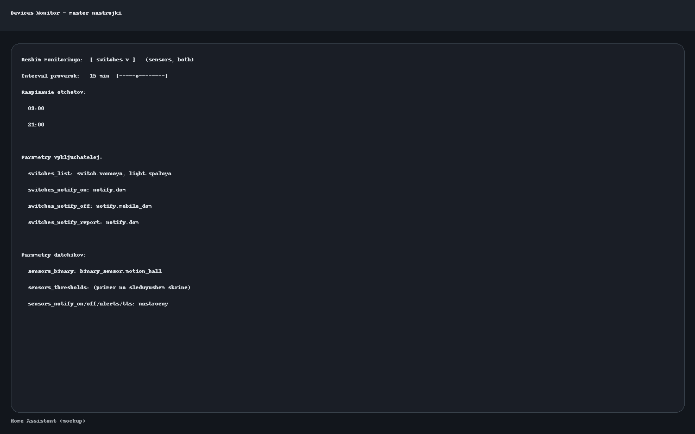
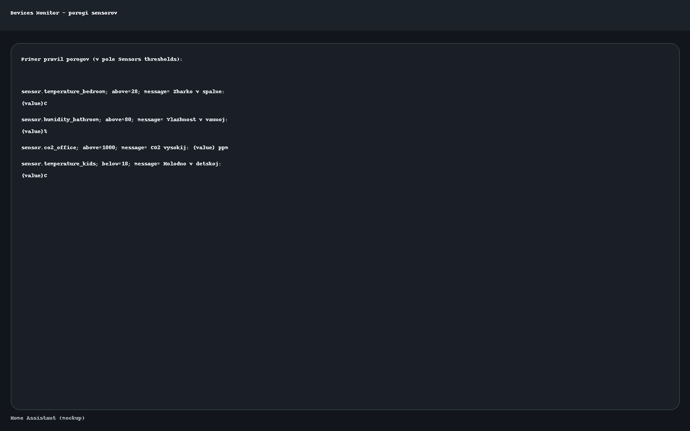
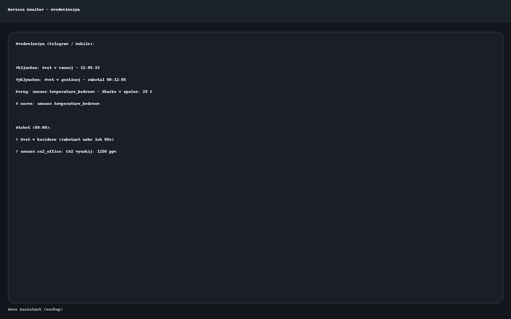
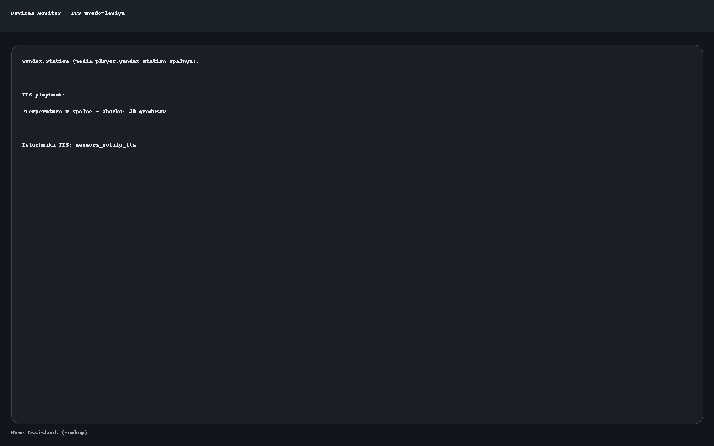

# 🏠 Devices Monitor — интеграция для Home Assistant

## 🔧 Назначение
`devices_monitor` — это объединённая интеграция для Home Assistant, которая совмещает возможности:
- **Switches Monitor** — контроль выключателей и светильников
- **Sensors Monitor** — мониторинг бинарных датчиков и сенсоров с порогами

Теперь всё в одном месте с единым мастером настройки и гибкими уведомлениями.

---

## ⚙️ Возможности
1. **Выбор режима**
   - `switches` — только выключатели
   - `sensors` — только датчики
   - `both` — всё вместе

2. **Мониторинг выключателей**
   - Уведомления при включении (ON) и выключении (OFF)
   - Отчёт о работающих устройствах по расписанию

3. **Мониторинг датчиков**
   - Binary sensors (`binary_sensor`) — тревоги и возврат в норму
   - Sensors с порогами (`sensor`) — правила выше/ниже + сообщение
   - Поддержка формата:
     ```yaml
     sensor.temperature_bedroom; above=28; message=🔥 Жарко в спальне: {value}°C
     sensor.humidity_bathroom; above=80; message=💧 Влажность в ванной: {value}%
     ```

4. **Уведомления**
   - Разные сервисы для выключателей и датчиков
   - Поддержка нескольких каналов: Telegram, Email, Mobile App
   - Голосовая озвучка через Яндекс.Станции (`media_player`)

5. **Отчёты**
   - По интервалу (например, каждые 15 минут)
   - По расписанию (например, в 09:00 и 21:00)
   - Сервис `devices_monitor.send_report` — можно вызвать вручную

---

## 🛠️ Установка
1. Скопируй папку `custom_components/devices_monitor/` в `/config/custom_components/`.
2. Перезапусти Home Assistant.
3. В настройках добавь интеграцию → **Devices Monitor**.
4. В мастере выбери режим (выключатели, датчики или оба) и настрой параметры.

---

## 📄 Пример конфигурации
```yaml
mode: both

switches_list:
  - switch.vannaya
  - light.spalnya
switches_notify_on: notify.dom
switches_notify_off: notify.mobile_dom
switches_notify_report: notify.dom

sensors_binary:
  - binary_sensor.motion_hall
sensors_thresholds: |
  sensor.temperature_bedroom; above=28; message=🔥 Жарко {value}°C
  sensor.humidity_bathroom; above=80; message=💧 Влажность {value}%
sensors_notify_on: notify.dom
sensors_notify_off: notify.mobile_dom
sensors_notify_alerts: |
  notify.dom
  notify.email_dom
sensors_notify_tts: |
  media_player.yandex_station_spalnya

interval: 15
report_schedule: |
  09:00
  21:00
```

---

## 🔔 Примеры уведомлений
- 🚨 Включён: Свет в ванной  
- ✅ Выключен: Свет в гостиной (работал 0ч 12м 5с)  
- ⚠️ Порог: sensor.temperature_bedroom — Жарко в спальне: 29 °C  
- ✅ В норме: sensor.temperature_bedroom  
- ⏱️ Отчёт:
  ```
  • Свет в коридоре (работает уже 1ч 5м)
  • sensor.co2_office: ⚠️ CO₂ высокий: 1150 ppm
  ```

---

## 📢 Поддержка TTS
При использовании Яндекс.Станций система может голосом озвучивать события:
- «Тревога: датчик движения в гостиной»
- «Температура в спальне — жарко: 29 градусов»
- «Все устройства в норме»


## Screenshots

### Master setup


### Sensor thresholds example


### Notifications


### Voice (TTS)

